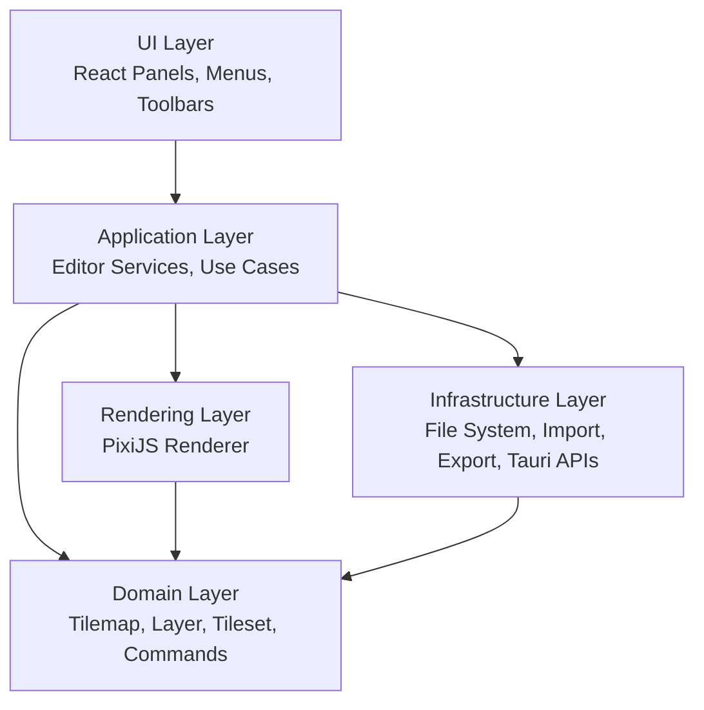

# Metk - Map Editor Toolkit

A desktop 2D tilemap editor for indie game developers, built with Tauri, React, TypeScript, and PixiJS.


---

## Overview

**Metk** is a desktop 2D tilemap editor designed for indie game developers who need a lightweight, extensible, and developer-friendly tool for building tile-based game maps.

The project focuses on:

- Layer-based tilemap editing
- Tileset management
- Rule-based auto-tiling
- TMX export workflows

Metk is currently being developed as both a personal project and a potential open-source tool for the indie game development community.

---

## Preview


---

## Project Status

Metk is currently in active development.

The current version focuses on building the core editor foundation, including tilemap rendering, layer-based editing, tileset handling, and export workflows.

Some advanced features are still under development, including:

- More polished editor interactions
- Advanced auto-tiling tools
- Plugin support
- Better documentation
- Release packaging for end users

This repository is not yet a fully polished production release, but it is being structured as a serious long-term editor project.

---

## Tech Stack

| Area | Technology |
|---|---|
| Desktop Runtime | Tauri |
| Frontend | React, TypeScript, Vite |
| Rendering | PixiJS, pixi-viewport |
| State Management | Zustand |
| Styling | Tailwind CSS |
| UI / Components | React component-based UI |
| Testing | Vitest, Testing Library |
| Data / File Processing | XML / JSON processing tools |

---

## Architecture

Metk is designed around a modular architecture inspired by Clean Architecture principles.

The main goal is to keep the editor logic separated from UI details, rendering details, and platform-specific APIs. This makes the project easier to test, extend, and maintain.



### Main Design Goals

- Keep domain models independent from UI framework details
- Avoid using React for high-frequency canvas rendering
- Use PixiJS for rendering tilemaps efficiently
- Keep import/export logic separated from editor state
- Prepare the project for future plugin support

---

## Getting Started

### Prerequisites

Before running the project, make sure the following tools are installed:

- Node.js
- Rust toolchain
- Tauri system dependencies
- Microsoft C++ Build Tools, required on Windows

> Linux and macOS setup instructions are still being documented.

---

## Installation

Clone the repository:

```bash
git clone https://github.com/TranNgocLamVy/Metk.git
cd Metk
```

Install dependencies:

```bash
npm install
```

Run the application in development mode:

```bash
npm run tauri dev
```

Build the desktop application:

```bash
npm run tauri build
```

---

## Available Scripts

| Command | Description |
|---|---|
| `npm run dev` | Start the Vite development server |
| `npm run build` | Type-check and build the frontend |
| `npm run check` | Run TypeScript type checking |
| `npm run test` | Run tests in watch mode |
| `npm run test:run` | Run tests once |
| `npm run test:coverage` | Generate test coverage |
| `npm run test:all` | Run type checking and tests |
| `npm run tauri dev` | Start the Tauri desktop application in development mode |
| `npm run tauri build` | Build the production desktop application |

---

## Project Structure

> This structure may change as the project continues to evolve.

```text
Metk/
├── src/                  # Frontend source code
├── src-tauri/            # Tauri and Rust desktop runtime
├── public/               # Static assets
├── docs/                 # Documentation and README assets
├── package.json          # Project scripts and frontend dependencies
└── README.md
```

Recommended long-term structure:

```text
src/
├── app/                  # App-level setup and providers
├── domain/               # Core editor models and business rules
├── application/          # Editor use cases and services
├── infrastructure/       # File system, import/export, Tauri integration
├── graphics/             # PixiJS rendering logic
├── components/           # Reusable UI components
├── features/             # Feature-specific UI and logic
└── stores/               # Zustand stores
```

---

## License

### QUICK SUMMARY:
- You ARE allowed to **use, distribute, and modify this code for all intents and purposes.**
- You ARE allowed to self-host this for your own personal use.
- RECIPROCAL LICENSING: **If you modify this code or use it to power a website or service (SaaS)**, you MUST make your **entire source code** (including all edits) **publicly available** under this same AGPLv3 license.
- You CANNOT use the "Metk" name or branding for your own project.

Copyright (c) 2026 TranNgocLamVy

Metk is released under the GNU Affero General Public License v3.0 (AGPL-3.0). See the [LICENSE.md](LICENSE.md) file for the full, official legal text.