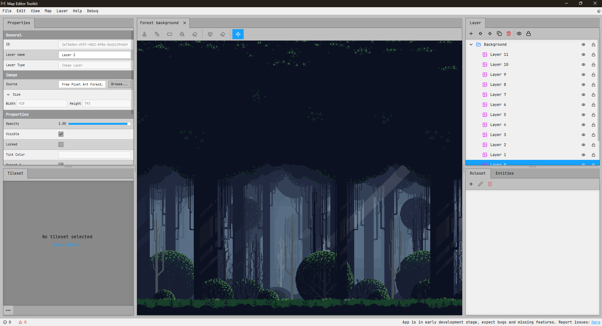

# Metk - Map Editor Toolkit

**Metk** is a comprehensive 2D tilemap editor designed to make building game levels easy. It speeds up your workflow by providing multiple drawing tools, multi-layer editing, and ruleset-based auto-tiling. Once your design is complete, you can easily export your maps into standard formats (like JSON or .tmx) that are ready to drop directly into any game engine.



# Installing Metk

### Requirements
- Node.js
- Rust Toolchain (cargo, rustc)
- Window: Microsoft C++ Build Tools
- Linux: TODO:
- macOS: TODO:

### Build Process
1. Clone the repository.
2. Initialize dependencies:
```bash
npm install
```

Execute the application in development mode with hot-reloading:
```bash
npm run tauri dev
```

Compile a production-ready binary:
```bash
npm run tauri build
```

## License

### QUICK SUMMARY:
- You ARE allowed to **use, distribute, and modify this code for all intents and purposes.**
- You ARE allowed to self-host this for your own personal use.
- RECIPROCAL LICENSING: **If you modify this code or use it to power a website or service (SaaS)**, you MUST make your **entire source code** (including all edits) **publicly available** under this same AGPLv3 license.
- You CANNOT use the "Metk" name or branding for your own project.

Copyright (c) 2026 TranNgocLamVy

Metk is released under the GNU Affero General Public License v3.0 (AGPL-3.0). See the [LICENSE.md](LICENSE.md) file for the full, official legal text.